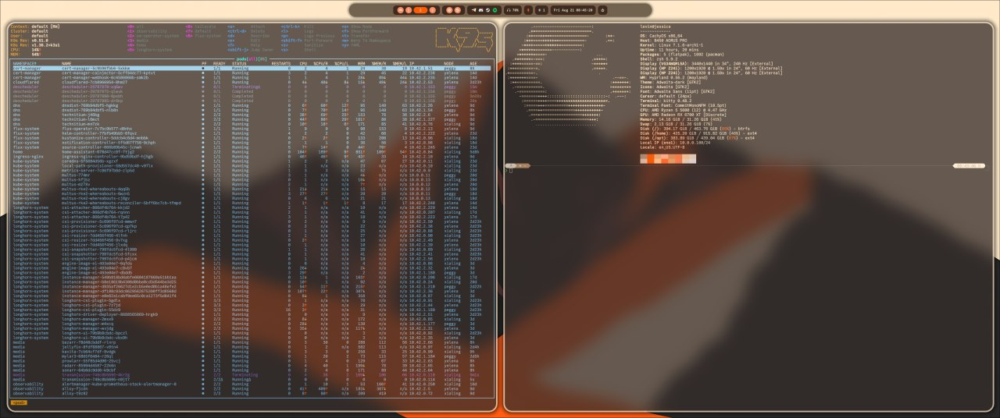

# CachyOS-Hyprland

Personal workstation bootstrap for CachyOS with Hyprland. Uses Ansible for package installation and system configuration, GNU Stow for dotfile management. Single-machine setup designed for quick deployment on fresh installs.

## Screenshots




## Quick Start

```bash
./setup.sh
```

Requires CachyOS or Arch Linux. The script installs Ansible and Stow, then runs the playbook with sudo privileges.

## Components

### Dotfiles (stow packages)

| Package | Description |
|---------|-------------|
| firefoxpwa | Firefox PWA configuration |
| hyprland | Hyprland window manager config |
| hyprland-preview-share-picker | Screen share picker for Hyprland |
| mako | Notification daemon |
| rofi | Application launcher |
| sddm | Display manager theme |
| solaar | Logitech device manager |
| spotify | Spotify client config |
| wallpapers | Desktop wallpapers |
| waybar | Status bar |
| wob | Wayland overlay bar |
| xdg-terminal-exec | XDG terminal execution |
| zsh-local | Machine-local zsh overrides |

### Submodules

| Submodule | Description |
|-----------|-------------|
| zsh | Zsh configuration |
| neovim | Neovim configuration |
| kitty | Kitty terminal config |
| gitconfig | Git configuration |

## Adapting for Your Setup

1. Fork this repository
2. Edit `ansible/playbook.yaml` variables for your packages and preferences
3. Customize dotfiles in `dotfiles/` to match your workflow
4. Run `./setup.sh` on your target machine

## More Information

See [CONTEXT.md](CONTEXT.md) for architecture details and design decisions.